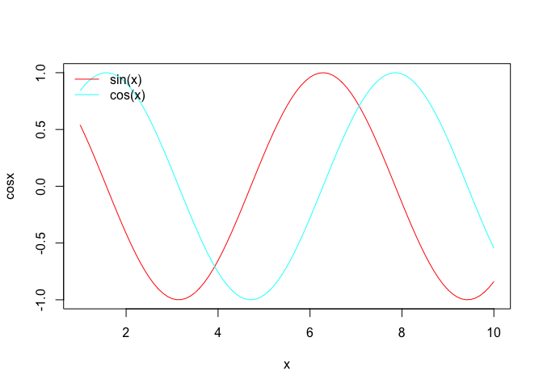
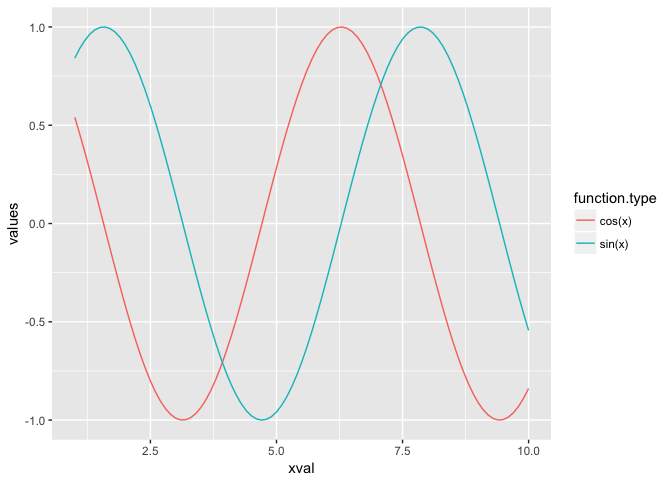
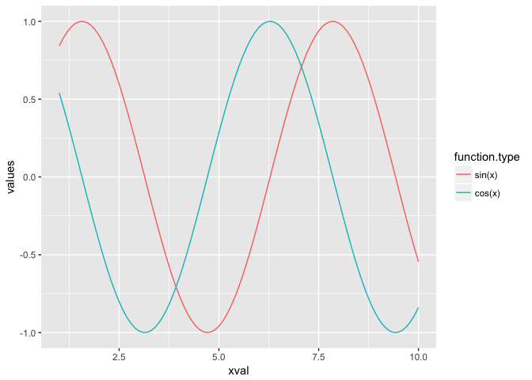

# R tutorial
Jeanette Mumford  

## 1 Installing R and getting started
[R](https://www.r-project.org/) is free and I highly recommend using R through the IDE, [RStudio](https://www.rstudio.com/), which offers a lot of helpful functionality like generating R markdown files easily and integrating with github.  A common confusion is that updating RStudio is also updating R, but this is not the case.  RStudio uses R, but they are updated and installed independently.

To install R and RStudio, start by installing R and then install RStudio second.  RStudio should automatically find R when it installs.

Like Python, R requires installing libraries for more advanced tools, but  the installation is typically very easy.  Most libraries you will want to use are located in the [CRAN](https://cran.r-project.org/) (Comprehensive R Archive Network), which can be accessed through R, directly.  The following illustrates how you'd install and load a package.


```r
# <-  The comment in R is the hash symbol

# To grab libraries for installation, R will ask you to
# select a CRAN "mirror".  The following line will set the
# mirror permanently so R doesn't ask you over and over again.
#  All the mirrors are listed here: https://cran.r-project.org/mirrors.html

# You only need to run this once ever (not once per session)
options(repos=structure(c(CRAN="http://cran.us.r-project.org")))


# To install a library use the following, note double quotes are used.
# A "newer" feature is dependencies (libraries the library of 
# interest needs) will automatically be installed.

# You only need to run this once ever (not once per session)
install.packages("ggplot2")
```

```
## 
## The downloaded binary packages are in
## 	/var/folders/yq/bcmg29nn0cj36tgk87ysnvq80000gn/T//RtmpMDJcrr/downloaded_packages
```

```r
# To load the library so you can access the functions 

# Run once per session if you'd like to use it
library("ggplot2")
```

```
## Warning: package 'ggplot2' was built under R version 3.3.2
```

For the above you will likely get more output than I did when you run install.packages, as I already had it installed.

Now open a new editor (in RStudio click the white page icon in the upper left and select, "R Script", and we'll write a quick "hello world".  Enter the following in the file and save it in a file called "first_script.R".

```r
print("Hello world")
```

I feel it is poor coding form to change working directories, so I always recommend typing out the full paths to files.  So edit the following to reflect where you just stored your file.  This will run your script.

```r
source("/Users/jeanettemumford/Documents/Research/Teaching/neurohackweek2017/first_script.R")
```

```
## [1] "Hello world"
```

If you want to run the script from the LINUX prompt you would use "Rscript first_script.R".  

In RStudio, you can simply hit cmd+return (on a Mac) to run the current line that the cursor is on, or you can copy and paste into the R terminal window.  Give that a shot with your single line in first_script.R and add these following simple commands and run them.


```r
a <- 4
b <- 10
a*b
a-b
```

Now, you will notice I use the "<-" symbol to assign a value to a variable.  You can also use "=" and the result is the same.  Why didn't the developers use the equal sign?  The short answer is it originally was used to set function values, for example in the command, rnorm(10, mean = 5), it is setting the mean value to 5 within the rnorm function.  Back in the day there was a single button that made the "<-" and, in fact, in some editors a shortcut still exists (e.g. Aquamacs).  I prefer fewer keystrokes and don't find it to be confusing, so I will be using the "=" in this tutorial.  You can read a longer answer [here](http://blog.revolutionanalytics.com/2008/12/use-equals-or-arrow-for-assignment.html).

There's one last way to assign a number to a variable and this can be very useful if you're creating variables in a loop and, for example, you would like the loop number to be included in the variable name.  

```r
assign("a", 5)
a
```

```
## [1] 5
```
To insert a variable name, you can combine assign() with another function in R that allows you to combine strings and variables.  The paste0() function and sprintf() allow for this.  

```r
x = 10
# paste0 simply connects everything
paste0("variable", x)
```

```
## [1] "variable10"
```

```r
# Alternatively, sprintf can work and has some additional flexibilities

# On your own, look at the help for sprintf.  By the way simply type "?" followed
#  by your command name to open the help page
?sprintf
sprintf("variable%s", x)
```

```
## [1] "variable10"
```

```r
# the %s acts as a fill in the blank for strings.  You'd need to change this for number input
```

### On your own
Play around with the paste or sprintf commands.  Try to create a variable called "variable10" that has a value of 4 using the following:

```r
a = "variable"
b = 10
c = 4
```

### Summary of functions from Section 1
For more information about any of these functions, simply type ?function.name at the R prompt to open the help.  Eg, ?options will tell you more about options().

Function Name | What it does
------------------------- | -------------------------
options | Let's you set various global options in R
install.packages | Used to install packages.  Only install once.
library | Load a library.  Needed each session 
print | Print strings to screen
source | Run all code contained in a file
<- | Older, but still commonly used, symbol for assigning values to a variable
assign | more flexible function for assigning values to a variable name

## 2 How data are stored
There are four main data types used in R: numeric, character, factor and logical.  Although numeric, character and logical tend to be more intuitive, factor can often be confusing and sometimes bad things happen if you don't realize something is a factor.  First I'll show each one and then I'll explain what this factor business is.


```r
# You can use the class() function to see what type of data R thinks you have

# Numbers (almost) always default to numeric
y = c(1,2,3,4)       # a vector of numbers
class(y)
```

```
## [1] "numeric"
```

```r
# Character
names = c("Anne", "Sean", "Lilly", "Logan") # a vector of strings
# Check the class of names()
class(names)
```

```
## [1] "character"
```

```r
# Factors
gender = c("m", "f", "m", "f", "m","m", "f")  # here it is a character
gender.factor = as.factor(gender)        
gender.factor
```

```
## [1] m f m f m m f
## Levels: f m
```

```r
class(gender)
```

```
## [1] "character"
```

```r
class(gender.factor)
```

```
## [1] "factor"
```

```r
# Logicals
# I'll cover how you generate T/F values in the next section
#  but the TRUE/FALSE input in R are special and are automatically 
#  recognized as logical values.  Importantly, don't use quotes!
b = c(TRUE, FALSE, TRUE, TRUE)
class(b)
```

```
## [1] "logical"
```
The reason R has factors relates to the main purpose of R: run statistical analyses.  In many models you run with categorical variables, there's a specific baseline comparison that makes the most sense.  For example, if I ran a model with three groups, adhd, bipolar and controls, I might prefer my regression coefficients use the control group as the reference and that's exactly what factors do, they allow you to set the reference.  

Probably the place you'll find this the most useful is when using ggplot.  If you want to change the order in which levels are plotted (say in a set of boxplots), releveling a factor into the order you'd like is the solution.  There will be an example later on.


```r
group = factor(c("adhd", "bipolar", "ctrl"))
# without doing anything, adhd is listed first, meaning it is the baseline
group
```

```
## [1] adhd    bipolar ctrl   
## Levels: adhd bipolar ctrl
```

```r
# use relevel to change reference
relevel(group, ref = "ctrl")
```

```
## [1] adhd    bipolar ctrl   
## Levels: ctrl adhd bipolar
```
Sometimes after reading in data it will automatically change things into factors that you wish were numbers.  Be very careful when you do this!  You must first convert to a character and then a numeric, otherwise it will use the level value as the value.  

```r
# Common mistake
# Going from factor to number
num.vec = as.factor(c(1.2, 1.4, 1.6))
num.vec
```

```
## [1] 1.2 1.4 1.6
## Levels: 1.2 1.4 1.6
```

```r
# Wrong way
as.numeric(num.vec)
```

```
## [1] 1 2 3
```

```r
# Correct way
as.numeric(as.character(num.vec))
```

```
## [1] 1.2 1.4 1.6
```
So far you've only been looking at vectors of numbers, but you'll often want to put a bunch of vectors together and there are multiple options including list, matrix, array, and  data frame.  The first three are found in many software packages, but the data frame is a special structure that makes the data much more useful for a lot of different R functions, including plotting and data manipulation.

The list is best for things of varying lengths.  Function output is typically put in a list.  This is analogous to the MATLAB structure.

Matrices are two dimensional and are best if you're working with an actual matrix.  For example a matrix of fMRI data where the columns correspond to different voxels.  If you plan on using matrix math, you'll want the data to be in a matrix.

Arrays can be multidimensional.

Data frames have columns with different meanings, or variables.  It is basically a list where the lengths of the entries are the same.  Data for input into regression analyses or plotting are typically put into data frames.


```r
mat.ex = matrix(c(1,2,3,4,5,6), nrow = 2)
dim(mat.ex)
```

```
## [1] 2 3
```

```r
mat.ex
```

```
##      [,1] [,2] [,3]
## [1,]    1    3    5
## [2,]    2    4    6
```

```r
array.ex = array(c(1:24), c(4, 3, 2))
dim(array.ex)
```

```
## [1] 4 3 2
```

```r
array.ex
```

```
## , , 1
## 
##      [,1] [,2] [,3]
## [1,]    1    5    9
## [2,]    2    6   10
## [3,]    3    7   11
## [4,]    4    8   12
## 
## , , 2
## 
##      [,1] [,2] [,3]
## [1,]   13   17   21
## [2,]   14   18   22
## [3,]   15   19   23
## [4,]   16   20   24
```

```r
list.ex = list()
list.ex$a = c(1:10)
list.ex$b = c(45:70)
list.ex$c = factor(c("a1", "b1", "c1"))
list.ex$d = as.character(c("bat", "cat", "bird", "dog"))
length(list.ex)
```

```
## [1] 4
```

```r
list.ex
```

```
## $a
##  [1]  1  2  3  4  5  6  7  8  9 10
## 
## $b
##  [1] 45 46 47 48 49 50 51 52 53 54 55 56 57 58 59 60 61 62 63 64 65 66 67
## [24] 68 69 70
## 
## $c
## [1] a1 b1 c1
## Levels: a1 b1 c1
## 
## $d
## [1] "bat"  "cat"  "bird" "dog"
```

```r
# you can pull out one element of the list using $
list.ex$d
```

```
## [1] "bat"  "cat"  "bird" "dog"
```

```r
col1 = c(1:10)
col2 = c(21:30)
col3 = rep(c("a1", "b1"), each = 5)
data.frame.ex = data.frame(col1, col2, col3)
data.frame.ex
```

```
##    col1 col2 col3
## 1     1   21   a1
## 2     2   22   a1
## 3     3   23   a1
## 4     4   24   a1
## 5     5   25   a1
## 6     6   26   b1
## 7     7   27   b1
## 8     8   28   b1
## 9     9   29   b1
## 10   10   30   b1
```

```r
dim(data.frame.ex)
```

```
## [1] 10  3
```

```r
names(data.frame.ex)
```

```
## [1] "col1" "col2" "col3"
```

```r
# you can pull columns of a data frame out using the column name
data.frame.ex$col1
```

```
##  [1]  1  2  3  4  5  6  7  8  9 10
```

```r
# you can also add a new column to a pre-existing data frame
data.frame.ex$col4 = rep(c("m", "f"), 5)
data.frame.ex
```

```
##    col1 col2 col3 col4
## 1     1   21   a1    m
## 2     2   22   a1    f
## 3     3   23   a1    m
## 4     4   24   a1    f
## 5     5   25   a1    m
## 6     6   26   b1    f
## 7     7   27   b1    m
## 8     8   28   b1    f
## 9     9   29   b1    m
## 10   10   30   b1    f
```

```r
# you can easily convert a matrix to a data.frame and add names
df.ex2 = matrix(1:18, ncol = 3)
df.ex2 = data.frame(df.ex2)
names(df.ex2) = c("col1", "col2", "col3")
df.ex2
```

```
##   col1 col2 col3
## 1    1    7   13
## 2    2    8   14
## 3    3    9   15
## 4    4   10   16
## 5    5   11   17
## 6    6   12   18
```

It is easy to construct diagonal matrices and extract diagonals from matrices in R.  The same command is use.

```r
a = matrix(1:9, nrow = 3)
diag(a)
```

```
## [1] 1 5 9
```

```r
diag(c(1,2,3))
```

```
##      [,1] [,2] [,3]
## [1,]    1    0    0
## [2,]    0    2    0
## [3,]    0    0    3
```

```r
# you can even change the diagonal of the matrix
# Here I'll change it to 1s
a
```

```
##      [,1] [,2] [,3]
## [1,]    1    4    7
## [2,]    2    5    8
## [3,]    3    6    9
```

```r
diag(a) = 1
a
```

```
##      [,1] [,2] [,3]
## [1,]    1    4    7
## [2,]    2    1    8
## [3,]    3    6    1
```

### On your own
Relevel only allows you to change the baseline level of a factor, but for plotting in ggplot you'll often want to change the overall order of the levels of a factor.  For the following, use the factor function and the "levels" option within it (look at the help for more details) to change the following factor so the levels are in the order: ctrl, bipolar, adhd.

```r
group = factor(c("adhd", "bipolar", "ctrl"))
```

Secondly, with the rep command I used above, make sure you understand what it is doing differently when I add the "each" option.

### Summary of functions from Section 2

Function Name | What it does
------------------------- | -------------------------
class | Tells you the data type
as.factor/as.character/as.numeric | set data type to factor/character/numeric
special values: TRUE, FALSE, NA | Use without quotes when creating data to indicate logical or missing data
relevel | Change the order of levels of a factor
matrix| How to create a matrix
array | How to create an array
data.frame | How to create a data frame
list | How to create a list
names | How to access names of data.frame (for viewing or changing)
dim | How to look at the dimension of your matrix/array/data.frame
length|  How to look at lengths of vectors/lists/etc
? | How you get help, eg. ?matrix will give the help for as.matrix
rep | repeat things.  Note how I used each, vs when I didn't use each

## 3 Simple commands
Above we've already seen that scalar math works as we'd expect, but here are a couple of extras.

```r
3 + 2
```

```
## [1] 5
```

```r
3 - 2
```

```
## [1] 1
```

```r
3 / 2
```

```
## [1] 1.5
```

```r
3 * 2
```

```
## [1] 6
```

```r
3 %% 2 # modulus 3 mod 2
```

```
## [1] 1
```

```r
3^2
```

```
## [1] 9
```

```r
# You can also use
3**2
```

```
## [1] 9
```

```r
sqrt(3)
```

```
## [1] 1.732051
```
Matrix math is a bit cumbersome

```r
a = matrix(c(1, 2, 3, 2, 1, 2, 2, 2, 1), nrow = 3)
a
```

```
##      [,1] [,2] [,3]
## [1,]    1    2    2
## [2,]    2    1    2
## [3,]    3    2    1
```

```r
# transpose
t(a)
```

```
##      [,1] [,2] [,3]
## [1,]    1    2    3
## [2,]    2    1    2
## [3,]    2    2    1
```

```r
# multiplication
a%*%a
```

```
##      [,1] [,2] [,3]
## [1,]   11    8    8
## [2,]   10    9    8
## [3,]   10   10   11
```

```r
# inverse 
solve(a)
```

```
##            [,1]       [,2]       [,3]
## [1,] -0.4285714  0.2857143  0.2857143
## [2,]  0.5714286 -0.7142857  0.2857143
## [3,]  0.1428571  0.5714286 -0.4285714
```
Extracting parts of a matrix is similar to other programs.

```r
a = matrix(c(1:9), nrow = 3)
a
```

```
##      [,1] [,2] [,3]
## [1,]    1    4    7
## [2,]    2    5    8
## [3,]    3    6    9
```

```r
# First row
a[1,]
```

```
## [1] 1 4 7
```

```r
# First column
a[,1]
```

```
## [1] 1 2 3
```

```r
# Second and third entry of the third row
a[3, 2:3]
```

```
## [1] 6 9
```
I've been using, for example, code like c(1:9) to create sequences, but there are other options.

```r
# sequence from 1 to 9
seq(1, 9)
```

```
## [1] 1 2 3 4 5 6 7 8 9
```

```r
# sequence from 1 to 9 in increments of 2
seq(1, 9, 2)
```

```
## [1] 1 3 5 7 9
```

```r
# sequence that count from 1 to 9 in increments such that the vector has a length of 11
seq(1, 9, length.out = 11)
```

```
##  [1] 1.0 1.8 2.6 3.4 4.2 5.0 5.8 6.6 7.4 8.2 9.0
```
The usual logical operators are available as well.

```r
a = c(1, 2, 3)
b = c(2, 2, 1)

a<b
```

```
## [1]  TRUE FALSE FALSE
```

```r
a<=b
```

```
## [1]  TRUE  TRUE FALSE
```

```r
a>b
```

```
## [1] FALSE FALSE  TRUE
```

```r
a!=b
```

```
## [1]  TRUE FALSE  TRUE
```

```r
a==b
```

```
## [1] FALSE  TRUE FALSE
```
You can also combine using and/or.

```r
c = c(4, 2, 1)

(a==b) & (b==c)
```

```
## [1] FALSE  TRUE FALSE
```

```r
(a==b) | (b==c)
```

```
## [1] FALSE  TRUE  TRUE
```
Handily (at least I think so) if you try to do math with a vector of TRUE/FALSE, the data are treated as 1/0 (1=TRUE)

```r
d = (a==b)
2*d
```

```
## [1] 0 2 0
```
You can use logical operators to pull out parts of a matrix or change the matrix

```r
a = matrix(1:9, nrow = 3)
# Values in a that are larger than 3
a[a>3]
```

```
## [1] 4 5 6 7 8 9
```

```r
# Change values larger than 3 to 0
a[a>3] = 0
a
```

```
##      [,1] [,2] [,3]
## [1,]    1    0    0
## [2,]    2    0    0
## [3,]    3    0    0
```

### On your own
Create a matrix with 3s on the main diagonal and 0s elsewhere and invert it.  Above you created an array called array.ex that is basically two 4x3 matrices stacked in the third dimension. Multiply together the first 4x3 matrix and the transpose of the second 4x3 matrix.

### Summary of functions from Section 3

Function Name | What it does
------------------------- | -------------------------
%% | Modulus
^ or ** | raise a number to a power
sqrt | square root
t() | Transpose of a matrix
%*% | Matrix multiplication
solve() | Matrix inverse
a[b,] | extract bth row from matrix, a
a[,b] | extract bth column from matrix, a
<, <=, >, >=, ==,!= | Logical operators
&, \| | "And" and "Or"

## 4 Looping
Looping in R has similar structure to other programs.  Bascially, you can loop through anything: numbers, characters, factors, etc.

```r
a = c("one", "two", "three")
for (i in a){
  print(i)
}
```

```
## [1] "one"
## [1] "two"
## [1] "three"
```

```r
a = c(1:3)
for (i in a){
  print(i)
}
```

```
## [1] 1
## [1] 2
## [1] 3
```

```r
# Equivalently
for (i in 1:3){
  print(i)
}
```

```
## [1] 1
## [1] 2
## [1] 3
```
If you're building a vector with a for loop, it is better to create an empty vector first and fill it.  The following illustrates the two styles and introduces the proc.time() function, which can be used to time procedures in R.

```r
start = proc.time()
# Initialize with a vector of 0s
vec = rep(0, 10000)
for (i in 1:10000){
  vec[i] = i
}
proc.time() - start
```

```
##    user  system elapsed 
##   0.017   0.000   0.017
```

```r
start = proc.time()
# Initialize with an empty vector 
vec = c()
for (i in 1:10000){
  #concatenate on each iteration
  vec = c(vec, i)
}
proc.time() - start
```

```
##    user  system elapsed 
##   0.239   0.007   0.248
```

While loops are used when you don't know how long something will take.  For example, if I'm randomly generating trial orderings, but I have 3-4 criteria that must be met for that trial order to work in my experiment I use a while loop.  For example, no more than 3 trials of the same type in a row, etc.


```r
# Start simple
stop = 10

while (stop > 1){
  print(stop)
  stop = stop -1
}
```

```
## [1] 10
## [1] 9
## [1] 8
## [1] 7
## [1] 6
## [1] 5
## [1] 4
## [1] 3
## [1] 2
```
Historically R has been very, very slow at looping and it is often advised to avoid loops when you can.  Matrix math tricks can often help, if you're comfortable with that, but there are also functions that can help cut down on looping.  The apply() function is a good example.  It allows you to apply an operation along one of the dimensions of an array.

```r
# I'll get row averages
a = matrix(c(1:9), nrow = 3)
apply(a, 1, mean)
```

```
## [1] 4 5 6
```

```r
# Column averages
apply(a, 2, mean)
```

```
## [1] 2 5 8
```

```r
# Standard deviation within each row
apply(a, 1, sd)
```

```
## [1] 3 3 3
```

```r
# Works on arrays also.  
b = array(c(1:12), c(2, 3, 2))
# If I want the sum across the first dimension
# then the result is in the 2:3 dimensions
apply(b, c(2:3), sum)
```

```
##      [,1] [,2]
## [1,]    3   15
## [2,]    7   19
## [3,]   11   23
```

```r
# If I want the sum within each of the 3rd dimensions
apply(b, 3, sum)
```

```
## [1] 21 57
```
### On your own
Write the for loops that give the same results as the two apply function examples above.

### Summary of functions from Section 4

Function Name | What it does
------------------------- | -------------------------
for (x in variable){} | Basic for loop structure
while (logical){} | Basic while loop structure
sample()  | Sample data with or without replacement
apply()  |  Apply an operation along dimension(s) of an array
mean()  | Average
sum()  | Summation function

## 5 Decision making
The if/else statement is frequently used in programming and there are a couple of ways to do it in R.  The classical style is in the following example.

```r
x = -5
if(x > 0){
   print("Non-negative number")
} else {
   print("Negative number")
}
```

```
## [1] "Negative number"
```
A shortcut for simple if/else statement is the ifelse function

```r
ifelse(x>0, "Non-negative number", "Negative number")
```

```
## [1] "Negative number"
```
The if/else statement can have nesting as well

```r
if (x < 0) {
   print("Negative number")
} else if (x > 0) {
   print("Positive number")
} else {
   print("Zero")
}
```

```
## [1] "Negative number"
```
### On your own
The Fibonacci numbers are the sequence of numbers defined by the linear recurrence equation Fn = Fn−1 + Fn−2 where F1 = F2 = 1.  So the first 5 terms are 1, 1, 2, 3, 5. Using a for loop and if statement, generate the first 8 terms of the Fibonacci sequence

### Summary of functions from Section 5

Function Name | What it does
------------------------- | -------------------------
if(condition){}else{}  | Structure of if/else
ifelse(condition, true, false) | Shorter if/else option

## 6 Writing functions
If you find yourself copying and pasting a chunk of code to reuse it, you should probably just write a function for that code.  Functions are also useful if you're looking to do something using the apply() function that doesn't have a function to apply already.  For example, if I want to run a regression over 10,000 voxels and save the p-value, I can create a function that spits out p-values and then use that with apply to run all of my 10,000 models at once!  It is a bit faster than looping.  First, let's look at a simple example.  Note that lists are often used to pass information out of the function using the return() function.

```r
# Simple function that determines if a number is odd

isodd = function(input){
  output = input%%2  # modulo operation from earlier
  result = output == 1
  return(result)
}
isodd(5)
```

```
## [1] TRUE
```

```r
isodd(6)
```

```
## [1] FALSE
```
Here's an example with two input and two values output

```r
sumprod = function(val1, val2){
  sumvals = val1 + val2
  prodvals = val1*val2
  result = list()
  result$sumvals = sumvals
  result$prodvals = prodvals
  return(result)
}
sumprod(1, 5)
```

```
## $sumvals
## [1] 6
## 
## $prodvals
## [1] 5
```

```r
sumprod(4, 10)
```

```
## $sumvals
## [1] 14
## 
## $prodvals
## [1] 40
```
One thing to be very careful about with functions is that although they are set up to take in variables to do something locally and then pass this back out to the global environment, it can (unfortunately) also use global variables.  In other words, if you already defined x in your R session and you refer to x within your function, the function will work if you forget to feed it in.

```r
x = 5
junkFunction = function(a, b){
  ax = a*x
  bx = b*x
  result = list()
  result$ax = ax
  result$bx = bx
  return(result)
}
# Even though x isn't fed in, the function grabs it from the global environment.  BE CAREFUL!!
junkFunction(3, 4)
```

```
## $ax
## [1] 15
## 
## $bx
## [1] 20
```

## 7 Plotting
When it comes to plotting, ggplot makes the most beautiful plots (IMHO).  That said, I almost always use simple plotting functions if I'm just quickly running through some analyses.  This could be because ggplot didn't exist when I first learned R, because folks I know who only learn ggplot seem to do okay.  There is a pretty steep learning curve, but once you get the hang of it, it isn't too bad.  Here I'll just show two simple examples of making a plot with two lines using plot and ggplot

```r
x = seq(1, 10, 0.1)
cosx = cos(x)
sinx = sin(x)

# simple function.  Default is points, so I change to line
plot(x, cosx, type = 'l', col = 'red')
# Add using lines function
lines(x, sinx, col = 'cyan')
# Add a legend
legend('topleft',c("sin(x)", "cos(x)"), lty = c(1, 1), col = c("red", "cyan"), bty = 'n')
```

<!-- -->

```r
# Two things with the above: lty tells legend you want solid lines.  Without that it won't add lines to the legend.  Also, you can see R is a big lacidasical about single vs double quotes.  I'm not consistent and it doesn't (typically) matter.

# Load the ggplot2 library
library(ggplot2)
# ggplot wants a data frame in long format
# Stack the values
values = c(cosx, sinx)
# Create a variable that indicates what is being plotted
function.type = rep(c("cos(x)", "sin(x)"), each = length(x))
xval = c(x, x)
plot.dat = data.frame(values, xval, function.type)

ggplot(plot.dat, 
       aes(x = xval, y = values, colour = function.type))+
  geom_line()
```

<!-- -->

```r
# If you want cos(x) second in the legend, make function type a factor and relevel
plot.dat$function.type = factor(plot.dat$function.type, c("sin(x)", "cos(x)"))
ggplot(plot.dat, 
       aes(x = xval, y = values, colour = function.type))+
  geom_line()
```

<!-- -->
There's much, much more you can do with ggplot.  Here's a good [starting point](http://tutorials.iq.harvard.edu/R/Rgraphics/Rgraphics.html) if you want to learn more.
### On your own
Using ggplot, add a third line to the plot: sin(x)+cos(x).

### Summary of functions from Section 7

Function Name | What it does
------------------------- | -------------------------
plot | makes basic plots
lines | adds a line to a plot started with plot()
ggplot | the start of the ggplot plotting function.  Other layers must be added to generate the plot
geom_line | Tells ggplot that you want a line plot

##8 Reading in data
In the past I have used the read.data function to read in data, but now there are faster options that work much better if you're reading in huge data: fread (data.table package) and read_csv (readr library).  More information about these can be found [here](http://analyticstraining.com/2015/if-youre-a-data-analyst-you-should-read-this-review-of-hadleys-readr-0-1-0-right-now/). 

```r
#install.packages("data.table") # Only run this if you've never installed it
#install.packages("readr")
library(data.table)
library(readr)
```

```
## Warning: package 'readr' was built under R version 3.3.2
```

```r
# This is simply the demo from the R help for fread, but it shows how much faster fread is!
# Make up a data set (I haven't covered data.table, but it is like data.frame)
n=1e6
DT = data.table( a=sample(1:1000,n,replace=TRUE),
                 b=sample(1:1000,n,replace=TRUE),
                 c=rnorm(n),
                 d=sample(c("foo","bar","baz","qux","quux"),n,replace=TRUE),
                 e=rnorm(n),
                 f=sample(1:1000,n,replace=TRUE) )
# Save it and get the size info
write.table(DT,"test.csv",sep=",",row.names=FALSE,quote=FALSE)
cat("File size (MB):", round(file.info("test.csv")$size/1024^2),"\n")
```

```
## File size (MB): 50
```

```r
#Here is the read.table timing.  The bit in the system.time() is what 
# you'd typically use to read it in.
# header=TRUE lets it know there's a header (column names)
# sep = "," is the delimiter
# quote="" disables quoting
# stringsAsFactors=FALSE is really handy, since you often
#     don't want the strings to automatically be made into factors

# note, the "=" notation won't work since the assignment is within another function
# so <- is used instead.
system.time(DF2 <- read.table("test.csv",header=TRUE,sep=",",stringsAsFactors=FALSE))
```

```
##    user  system elapsed 
##   9.919   0.196  10.163
```

```r
class(DF2)
```

```
## [1] "data.frame"
```

```r
# read_csv from readr
system.time(DF3 <- read_csv("test.csv"))
```

```
## Parsed with column specification:
## cols(
##   a = col_integer(),
##   b = col_integer(),
##   c = col_double(),
##   d = col_character(),
##   e = col_double(),
##   f = col_integer()
## )
```

```
##    user  system elapsed 
##   0.829   0.042   0.879
```

```r
class(DF3)
```

```
## [1] "tbl_df"     "tbl"        "data.frame"
```

```r
# fread from data.table
system.time(DT <- fread("test.csv"))
```

```
##    user  system elapsed 
##   0.434   0.019   0.455
```

```r
class(DT)
```

```
## [1] "data.table" "data.frame"
```
It used to be the case the fread was only a data.table format, which made plotting in ggplot2 difficult, since that requires a data.frame.  Guess they've changed it!  I would use either fread or read_csv, although read_csv will only work for comma delimited files.  Now for some cleanup, since we created a big file that we don't need...

```r
# system() allows us to run a command in the Linux environment
system("rm test.csv")
```

### Summary of functions from Section 8

Function Name | What it does
------------------------- | -------------------------
read.table | Older function for reading in data.  Flexible, but slow
fread | Part of data.table library. Fast and simple way to read in data.  Once loaded data is both a data.table and data.frame, which is good for things like ggplot2
read_csv | part of readr library.  Not as fast as fread, but treats as tbl_df, tble and data.frame
system | Allows you to run commands in Linux/Unix via R


##9 Other useful things I probably won't have time to cover
I'm guessing we will have run out of town by this point, but I wanted to mention the extremely useful tidyr and dplyr libraries.  Together these two libraries provide really great functions for manipulating data frames.  Here's a [cheatsheet](https://www.rstudio.com/wp-content/uploads/2015/02/data-wrangling-cheatsheet.pdf) and you can read more about it [here](https://rpubs.com/bradleyboehmke/data_wrangling).  A couple of quick examples are in the following.  Typically I use it to convert between wide and long data formats. 

```r
# install.packages("dplyr")
# install.packages("tidyr")
# install.packages("Lahman")
library(dplyr)
```

```
## -------------------------------------------------------------------------
```

```
## data.table + dplyr code now lives in dtplyr.
## Please library(dtplyr)!
```

```
## -------------------------------------------------------------------------
```

```
## 
## Attaching package: 'dplyr'
```

```
## The following objects are masked from 'package:data.table':
## 
##     between, last
```

```
## The following objects are masked from 'package:stats':
## 
##     filter, lag
```

```
## The following objects are masked from 'package:base':
## 
##     intersect, setdiff, setequal, union
```

```r
library(tidyr)
```

```
## Warning: package 'tidyr' was built under R version 3.3.2
```

```r
library(Lahman)  #I'm using a data set from this library
```

```
## Warning: package 'Lahman' was built under R version 3.3.2
```

```r
# Use this Batting data (this is in the Lahman library)
dim(Batting)
```

```
## [1] 102816     22
```

```r
names(Batting)
```

```
##  [1] "playerID" "yearID"   "stint"    "teamID"   "lgID"     "G"       
##  [7] "AB"       "R"        "H"        "X2B"      "X3B"      "HR"      
## [13] "RBI"      "SB"       "CS"       "BB"       "SO"       "IBB"     
## [19] "HBP"      "SH"       "SF"       "GIDP"
```

```r
players = group_by(Batting, playerID)
#players looks the same, but has more info, as the grouping has been defined
dim(players)
```

```
## [1] 102816     22
```

```r
dim(Batting)
```

```
## [1] 102816     22
```

```r
head(players)
```

```
## Source: local data frame [6 x 22]
## Groups: playerID [6]
## 
##    playerID yearID stint teamID   lgID     G    AB     R     H   X2B   X3B
##       <chr>  <int> <int> <fctr> <fctr> <int> <int> <int> <int> <int> <int>
## 1 abercda01   1871     1    TRO     NA     1     4     0     0     0     0
## 2  addybo01   1871     1    RC1     NA    25   118    30    32     6     0
## 3 allisar01   1871     1    CL1     NA    29   137    28    40     4     5
## 4 allisdo01   1871     1    WS3     NA    27   133    28    44    10     2
## 5 ansonca01   1871     1    RC1     NA    25   120    29    39    11     3
## 6 armstbo01   1871     1    FW1     NA    12    49     9    11     2     1
## # ... with 11 more variables: HR <int>, RBI <int>, SB <int>, CS <int>,
## #   BB <int>, SO <int>, IBB <int>, HBP <int>, SH <int>, SF <int>,
## #   GIDP <int>
```

```r
head(Batting)
```

```
##    playerID yearID stint teamID lgID  G  AB  R  H X2B X3B HR RBI SB CS BB
## 1 abercda01   1871     1    TRO   NA  1   4  0  0   0   0  0   0  0  0  0
## 2  addybo01   1871     1    RC1   NA 25 118 30 32   6   0  0  13  8  1  4
## 3 allisar01   1871     1    CL1   NA 29 137 28 40   4   5  0  19  3  1  2
## 4 allisdo01   1871     1    WS3   NA 27 133 28 44  10   2  2  27  1  1  0
## 5 ansonca01   1871     1    RC1   NA 25 120 29 39  11   3  0  16  6  2  2
## 6 armstbo01   1871     1    FW1   NA 12  49  9 11   2   1  0   5  0  1  0
##   SO IBB HBP SH SF GIDP
## 1  0  NA  NA NA NA   NA
## 2  0  NA  NA NA NA   NA
## 3  5  NA  NA NA NA   NA
## 4  2  NA  NA NA NA   NA
## 5  1  NA  NA NA NA   NA
## 6  1  NA  NA NA NA   NA
```

```r
# Now I can create easy summaries, over players...
games = summarise(players, total = sum(G))

# dplyr adds the %>% function, which serves as a "pipe", piping the output from one
#  command into the input of the next.  Really cleans up code.  This does what the above code did
games.using.dplyr = Batting %>%
  group_by(playerID) %>%
  summarise(total = sum(G))
```
### Summary of functions from Section 9

Function Name | What it does
------------------------- | -------------------------
tidy (library)  | really useful library of functions
dplry (library) | Another really useful library
groupby | Function that adds grouping to data frame
summarise | Once data are grouped (using groupby) allows summaries within group
%>%  | The piping function from dplyr.  Once you get the hang of this, it is a fantastic tool
## 10 Reading in NIfTI files
There are more and more libraries for dealing with fMRI data, or simulating fMRI data, but I typically use the fmri library to read in NIfTI data.  The only snag is the nifti file needs to be unzipped first.

```r
library(fmri)
```

```
## Loading required package: awsMethods
```

```
## 
## Use the function setCores() to change the number of CPU cores.
```

```
## 
## Attaching package: 'awsMethods'
```

```
## The following object is masked from 'package:tidyr':
## 
##     extract
```

```
## Loading required package: nlme
```

```
## 
## Attaching package: 'nlme'
```

```
## The following object is masked from 'package:dplyr':
## 
##     collapse
```

```r
# First load in the structure
# This file is already unzipped
dat.struct = read.NIFTI("~/Dropbox/NeuroHackWeek/bold.nii")
dat = extract.data(dat.struct)
dim(dat)
```

```
## [1]  64  64  30 182
```
